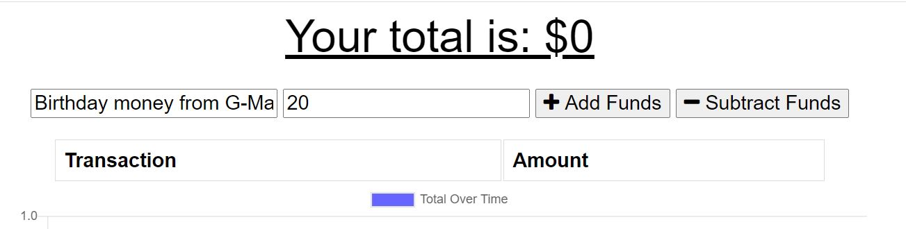
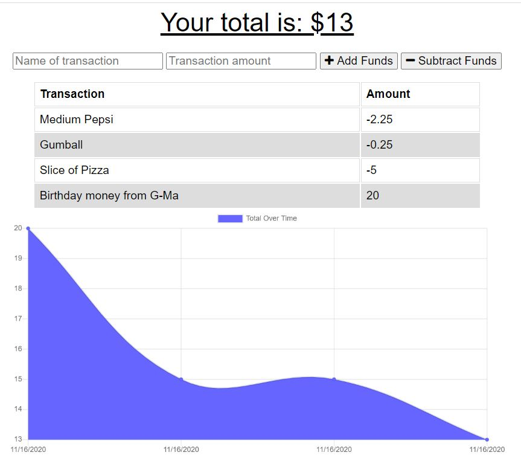
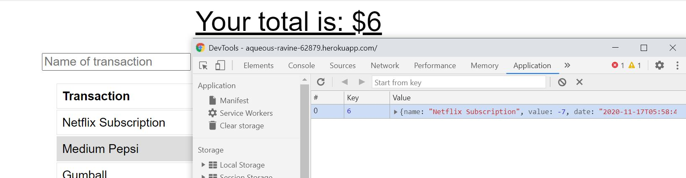

# Budget_Tracker

An easy to use budget tracker that works whether or not you're connected to teh internet.

## Table of Content
  * [Link](#link)

  * [Usage](#usage)

  * [Installation](#installation)
  
  * [License](#license)

  * [Questions](#questions)

## Link
Deployed at: https://aqueous-ravine-62879.herokuapp.com/

## Usage
Start by adding funds

Then either add or subtract funds to see the graph populate.

When you lose internet access, don't fret.  Anything you need to add or subtract from your budget will be saved in indexeDB, and held there until you're back online.  Then it will be added to the database with the rest of the data.

## Insatallation
Click on the three dots in the upper right corner of your window, and select "Install Budget Tracker" to install the app on your local machine.

Budget entries made in the app will appear in the webversion as well.

## License 
<https://unlicense.org>

## Questions
Follow me on GitHub at https://github.com/Carl-33
Feel free to reach out with any questions at koepkecj@gmail.com

